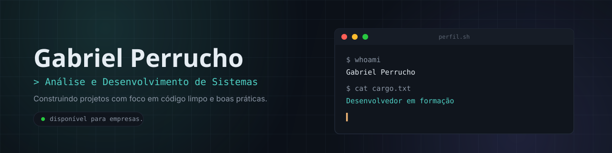

<!--
  ============================================================
  README DO PERFIL DO GITHUB
  Este arquivo vai no repositório especial: [SEU-GITHUB]/[SEU-GITHUB]
  (crie um repositório público com o MESMO nome do seu usuário)
  Troque todos os [PLACEHOLDERS] pelas suas informações reais.
  ============================================================
-->

<div align="center">

<!-- Banner — veja banner.svg / BANNER_PROMPT.md para gerar/editar -->


<br />

# Hello, I am Gabriel Perrucho. 👋

### Developer in Training · Systems Analysis and Development

[](https://linkedin.com/in/[SEU-LINKEDIN])
[](mailto:[SEU-EMAIL]@exemplo.com)
[](https://[SEU-DOMINIO-OU-USUARIO].vercel.app)

</div>

<br />

## 📌 About Me

```txt

I am a Systems Analysis and Development student at Universidade Tiradentes/SE,
with an interest in SOC, IAM, XAI, AI Systems Engineering, and Threat Intelligence.

I am seeking my first opportunity as an intern or junior developer,
working on real-world projects to learn through hands-on experience.

```

- 🎓 Taking a course in currently studying **Systems Analysis and Development** — Universidade Tiradentes/SE
- 🔭 Currently working on **personal projects**
- 📫 Contact: **gabrielgperrucho@gmail.com**

<br />

## 🧰 Technologies and tools

<div align="center">

**Languages**


**Front-end & Back-end**


**Databases and Tools**


<!-- Ajuste os badges acima para refletir exatamente as tecnologias que você usa -->

</div>

<br />

## 🚀 Featured projects

<table>
  <tr>
    <td width="50%">
      <strong>[NOME DO PROJETO 1]</strong><br />
      <sub>[Descrição curta do projeto em uma linha]</sub><br /><br />
      <a href="https://github.com/[SEU-GITHUB]/[PROJETO-1]">código</a> ·
      <a href="https://[PROJETO-1].vercel.app">demo</a>
    </td>
    <td width="50%">
      <strong>[NOME DO PROJETO 2]</strong><br />
      <sub>[Descrição curta do projeto em uma linha]</sub><br /><br />
      <a href="https://github.com/[SEU-GITHUB]/[PROJETO-2]">código</a>
    </td>
  </tr>
</table>

📎 See all the projects on my [portfólio pessoal](https://[SEU-DOMINIO-OU-USUARIO].vercel.app).

<br />

## 📊 GitHub Statistics

<div align="center">


<br />


</div>

> As imagens acima são geradas automaticamente pelos serviços públicos **github-readme-stats** e **github-readme-streak-stats** — basta trocar `[SEU-GITHUB]` pelo seu usuário para que funcionem.

<br />

## 🌐 Contributions

<div align="center">
  
</div>

<br />

## 📫 Contact

<div align="center">

[](https://linkedin.com/in/[SEU-LINKEDIN])
[](https://instagram.com/[SEU-INSTAGRAM])
[](mailto:[SEU-EMAIL]@exemplo.com)

</div>

<br />

<div align="center">
<sub></sub>
</div>
